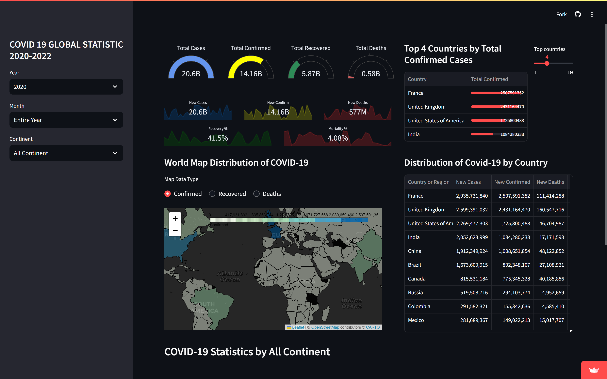
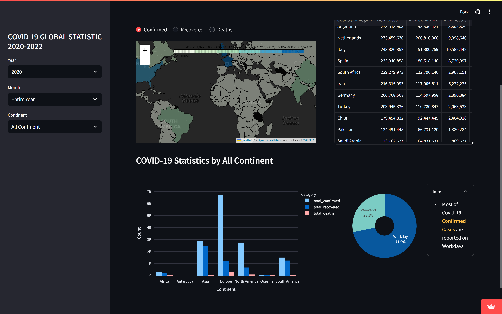

# Dashboard of Covid 19 Pandemic 2020 - 2022
This dashboard uses data on the global distribution of COVID-19 from 2020 to 2022 through various perspectives, namely geography, continent, country, and season. Here is a detailed explanation of what is in the dashboard

1. Total Cases, Total Confirmed, Total Recovered, and Total Deaths
These parameters provide a comprehensive summary of the global impact of COVID-19.

3. World Map Distribution
Using an interactive world map, this feature allows users to see the geographic spread of the pandemic across different regions and countries.

4. Distribution of Covid 19 per continent
Provides aggregate data showing how COVID-19 is affecting the continents of Africa, Antarctica, Asia, Australia/Oceania, Europe, North America, and South America.

5. Distribution of Covid 19 per Season
It contains the spread of COVID-19 in different climate seasons. There are autumn, summer, spring, winter, dry season, and wet season.

6. Distribution of Covid 19 per Country
Includes data on the number of confirmed cases, recoveries, deaths, and vaccination rates for each country.

7. Top 5 Confirmed Cases
Contains countries with the highest number of confirmed COVID-19 cases. This metric identifies where the virus has spread most extensively.

8. Top 5 Recovery Cases
Contains countries with the highest number of recovered COVID-19 cases. This metric shows countries with effective healthcare and treatment have made significant recoveries.

9. Top 5 Death Cases
Contains countries with the highest number of COVID-19 related deaths. This metric reflects the severity of the pandemic's impact on mortality.
